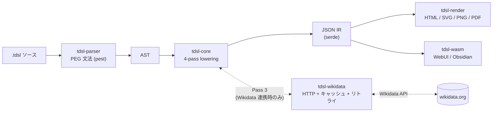
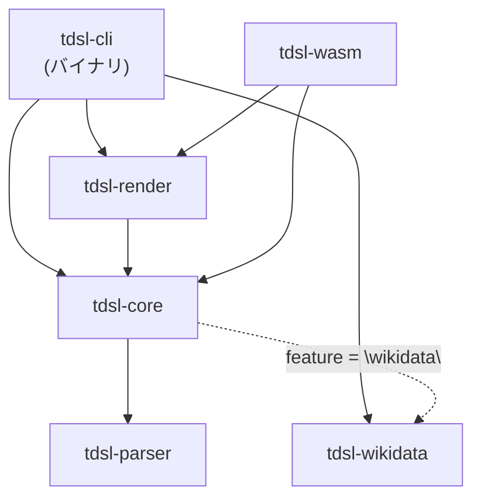

# Timeline DSL

[](https://github.com/keroway/timeline-dsl/actions/workflows/ci.yml)
[](https://github.com/keroway/timeline-dsl/actions/workflows/release.yml)
[](./LICENSE)
[](https://doc.rust-lang.org/edition-guide/rust-2024/)
[](https://pest.rs/)
[](./crates/tdsl-wasm)
[](https://www.npmjs.com/package/@keroway/tdsl-wasm)
[](https://marketplace.visualstudio.com/items?itemName=keroway.timeline-dsl)

年表特化のドメイン固有言語（DSL）コンパイラ。テキストベースで年表を定義し、WikidataからデータをインポートしてHTML/SVGで可視化できる。

**技術スタック**: Rust 2024 ワークスペース ／ [pest](https://pest.rs/) PEG パーサ ／ 4-pass IR lowering ／ ブラウザ向け `wasm-bindgen` ／ `serde` JSON IR。内部設計は [docs/architecture.md](docs/architecture.md) を参照。

**[ランディングページ →](https://timeline-dsl-lp.pages.dev/)** | **[WebUI で今すぐ試す →](https://keroway.github.io/timeline-dsl/)**

> English version: [README.md](./README.md)

## 特徴

- **宣言型DSL** — C風の構文で年表をテキスト定義。Git管理・差分レビューに最適
- **Wikidata連携** — QIDを指定するだけで歴史データを自動取得。ローカルキャッシュ（24時間TTL）でオフライン利用も可能
- **インタラクティブHTML出力** — ズーム・パン・検索・凡例・詳細パネルを内蔵したスタンドアロンHTMLを生成
- **SVG出力** — ベクター形式で書き出し。論文・スライドへの組み込みに
- **PDF出力** — ベクター PDF を出力（`svg2pdf` 経由）。印刷・文書への埋め込みに
- **カラーマッピング** — タグ→色の対応を DSL 内または CLI フラグで指定
- **逆コンパイル** — JSON IRから`.tdsl`ソースを再生成
- **WebUI** — ブラウザ上でリアルタイム編集・プレビュー（WASM駆動）。フォントサイズ・ライト/ダークテーマ選択対応
- **レーン構造** — 王朝・人物・国などをレーン（縦軸カテゴリ）で整理
- **3種の時間要素** — `span`（存続期間）、`event`（点イベント）、`event_range`（期間イベント）
- **拡張時刻精度** — 年・月・日・分単位の時刻（`YYYY-MM-DDTHH:MM`）、秒単位の時刻とUTCオフセット（`YYYY-MM-DDTHH:MM:SS±HH:MM`、ADR 0003）、と紀元前の月日（例: `-0206-01-15`）に対応
- **ライセンス追跡** — Wikidataデータ（CC0）の出典を自動記録

## インストール

### ワンラインインストール（macOS / Linux）

```sh
curl -sSfL https://raw.githubusercontent.com/keroway/timeline-dsl/main/install.sh | sh
```

対応プラットフォーム: macOS (x86\_64, arm64)、Linux (x86\_64, aarch64)。

### ワンラインインストール（Windows）

PowerShell で実行します。

```powershell
irm https://raw.githubusercontent.com/keroway/timeline-dsl/main/install.ps1 | iex
```

### Homebrew（macOS / Linux）

```sh
brew tap keroway/tap
brew install tdsl
```

### cargo-binstall（高速）

```sh
cargo binstall tdsl-cli
```

[cargo-binstall](https://github.com/cargo-bins/cargo-binstall) を事前にインストールしておく必要があります。プリビルドバイナリを直接ダウンロードするため、ソースコンパイル不要です。

### cargo でインストール

```sh
cargo install --git https://github.com/keroway/timeline-dsl tdsl-cli
```

## クイックスタート

### 基本的な使い方

```bash
# DSLファイルをJSONにコンパイル
tdsl build examples/china_dynasties.tdsl --pretty

# 構文・意味チェック
tdsl check examples/china_dynasties.tdsl

# スタンドアロンHTMLにレンダリング（ブラウザで開くだけ。外部フォント/CDN依存なし）
tdsl render examples/china_dynasties.tdsl --output china.html
open china.html

# インタラクティブHTML（ズーム・パン・検索・詳細パネル付き）
tdsl render examples/china_dynasties.tdsl --interactive --output china.html

# 内容一覧表付きHTML（時期・ラベル・レーン・タグ列）
tdsl render examples/china_dynasties.tdsl --show-table --output china.html

# SVG形式で出力
tdsl render examples/china_dynasties.tdsl --format svg --output china.svg

# PNG形式で出力（resvg によるラスタライズ）
tdsl render examples/china_dynasties.tdsl --format png --output china.png

# PDF形式でベクター出力（svg2pdf 経由）
tdsl render examples/china_dynasties.tdsl --format pdf --output china.pdf

# A3 横向き・マージン 15mm で PDF を出力
tdsl render examples/china_dynasties.tdsl --format pdf --pdf-size a3 --pdf-landscape --pdf-margin 15 --output china_a3.pdf

# アイテムテーブルを複数ページに分割（--show-table 必須）
tdsl render examples/china_dynasties.tdsl --format pdf --show-table --pdf-pagination --output china_paginated.pdf

# 縦方向レイアウト（時間軸を上から下に描画）
tdsl render examples/china_dynasties.tdsl --orientation vertical --output china_vertical.html

# 補助グリッド線（decade / year / month）
tdsl render examples/china_dynasties.tdsl --grid decade --output china_grid.html

# レーンの group が連続する区間に背景帯を描画
tdsl render examples/china_dynasties.tdsl --layout-style group-bands --output china_bands.html

# Gantt スタイル（月グリッド強調 + 期間ラベル常時表示、プロジェクト管理向け）
tdsl render examples/china_dynasties.tdsl --layout-style gantt --output china_gantt.html

# Zigzag スタイル（レーン内アイテムを開始時刻順に上下交互に配置。単一/少数レーン向け。レーン数が 2 を超えると警告付きで通常レイアウトにフォールバック）
tdsl render examples/apollo_11.tdsl --layout-style zigzag --output apollo_zigzag.html

# ウォッチモード：ファイル変更を検知して自動再レンダリング（--output 必須、html / svg のみ対応）
tdsl render examples/china_dynasties.tdsl --watch --output china.html

# Wikidata連携つきコンパイル
tdsl build examples/china_with_import.tdsl --pretty

# オフラインモード（Wikidata フェッチを完全にスキップし、静的アイテムのみコンパイル）
tdsl build examples/china_with_import.tdsl --offline --pretty

# ASTダンプ（デバッグ用）
tdsl ast examples/china_dynasties.tdsl

# Wikidataエンティティの確認
tdsl fetch Q7209 --lang ja,en

# Wikipedia URL から QID を解決
tdsl resolve "https://ja.wikipedia.org/wiki/漢" --lang ja,en

# JSON IRから.tdslソースを逆コンパイル
tdsl decompile output.json --output restored.tdsl

# 複数ファイルをまとめてコンパイル（ファイル順にマージ）
tdsl build part1.tdsl part2.tdsl --pretty

# 複数ファイルを専用マージコマンドで結合
tdsl merge base.tdsl extensions.tdsl --output merged.json --pretty

# キャッシュの状態を確認
tdsl cache status

# 古いキャッシュエントリを削除（7日以上）
tdsl cache clear --older-than 7
```

### 最短フロー（Wikidata起点）

```bash
# 1) 候補を探す
tdsl search "漢王朝" --lang ja -n 5

# (任意) Wikipedia URL からQIDを解決
tdsl resolve "https://ja.wikipedia.org/wiki/漢"

# 2) QIDの年表化適性を確認
tdsl inspect Q7209 --lang ja,en

# 3) .tdsl 雛形を生成
tdsl scaffold wikidata \
  --qids Q7183,Q7209 \
  --timeline "中国王朝(生成)" \
  --lang ja,en \
  --target auto \
  --lane-mode per-entity \
  --output /tmp/china_scaffold.tdsl

# 4) HTMLに描画
tdsl render /tmp/china_scaffold.tdsl --output /tmp/china_scaffold.html
```

> `search / inspect / resolve / scaffold wikidata` はネットワーク接続が必要です。

### 最短フロー（手作業起点）

```bash
# 1) 年表テンプレート生成
tdsl init \
  --output /tmp/manual.tdsl \
  --timeline "架空世界年表" \
  --range-start 1000 \
  --range-end 1300 \
  --lanes "王国:kingdom,事件:incidents"

# 2) CSVから項目を追記
tdsl import-csv examples/fictional_empire_items.csv --append /tmp/manual.tdsl

# 3) 品質補正
tdsl lint /tmp/manual.tdsl --fix

# 4) HTMLに描画
tdsl render /tmp/manual.tdsl --output /tmp/manual.html

# 5) 項目を CSV に書き出し（import-csv と対称）
tdsl export-csv /tmp/manual.tdsl --offline --output /tmp/manual_items.csv
```

> `export-csv` は IR を CSV（`lane,type,start,end,time,label,tags,id,source,origin`）に書き出します。
> 全 10 列を `import-csv` で再取り込むと意味的に同値の IR が得られます。`source` / `origin`
> も往復保持され（#608）、DSL の `source_ref` / `ident` 文法で検証され、不正な値は silent に破棄せず
> 拒否されます。詳細は [docs/cli-spec.md](docs/cli-spec.md#export-csv) を参照。

## DSL文法

### timeline ブロック

タイトル・単位・表示範囲・暦法・カラーマッピングを宣言する。`unit` の許容値は `year` / `month` / `day` / `hour` / `minute` / `second` で、未知の値は lowering エラーになります。

```
timeline "中国王朝年表" {
    title "中国王朝年表";
    unit year;
    range -500..2000;
    calendar proleptic_gregorian;
    color_map {
        dynasty: "#3366cc";
        war:     "#cc0000";
    }
}
```

`color_map` は hex 色（`#RGB`, `#RGBA`, `#RRGGBB`, `#RRGGBBAA`）と単純な CSS 色キーワードを受け付けます。複雑な CSS 値は安全のため renderer が無視します。高度な装飾は CLI の `--custom-css` を使ってください。

`color_map` のキーはバレアイド `ident`（ASCII）と引用符付き文字列リテラル（任意 Unicode）のどちらも使えます。`"戦争"` のような日本語タグにも DSL 上で直接色を割り当てられます（#551）:

```
color_map {
    war: "#cc0000";     // バレアイド(ident)キー
    "戦争": "#cc0000";   // 文字列リテラルキー（非 ASCII）
}
```

### lane 宣言

年表の縦軸カテゴリを定義する。`as` で内部IDを指定。既知の `kind` は `custom` / `dynasty` / `person` / `country` / `event` で、未知の値は検証警告として報告されます。

```
lane "漢" as han { kind dynasty; order 20; }
```

### group ブロック

複数の lane をまとめてグループ化する。レンダリング時にグループラベルと境界線が表示され、視覚的に階層化される。`group` を使わない既存の `.tdsl` はそのまま動作する。

```
group "古代中国" {
    lane "秦" as qin { kind dynasty; order 10; }
    lane "漢" as han { kind dynasty; order 20; }
}
```

### span / event / event_range

年表の時間要素。レーンに紐付ける。

```
// 存続期間
span han -206..220 "漢" { tags ["dynasty"]; source wd:Q7209; id "span:han"; note "説明"; link "https://www.wikidata.org/wiki/Q7209"; color "#3366cc"; };

// 点イベント
event han -209 "陳勝・呉広の乱" {};

// 期間イベント（戦争・災害など）
event_range han 184..204 "黄巾の乱" { tags ["war"]; };

// 継続中（オープンエンド）の期間：終了に `now` を使う
span reiwa 2019..now "令和" { tags ["era"]; };
```

`now` はビルド/パース時点の現在年（UTC）に解決され、IR 上では `end_open: true` として継続中であることが保持されます。出力された HTML/SVG は `tdsl-item-open-ended` クラス（デフォルトで破線囲み）を持ち、ツールチップには終了日の代わりに進行中マーカーが表示されます。`tdsl decompile` は当該アイテムを `now` で再出力します。スコープ外: `map` ブロック内での `now` フォールバック（例: `end claim(P582).year ?? now;`）は未対応。`now` は `span` / `event_range` の直接定義の `end` 位置のみで使えます。

アイテム共通オプションとして `note "...";`、`link "https://...";`（`http://` / `https://` のみ許可）、`color "...";` も指定できます。個別 `color` は `color_map` のタグ色や lane パレット色より優先されます。

### import ブロック

Wikidataからのデータ取り込みを宣言する。

```
import wikidata as wd {
    entity Q7183 as qin_dynasty;
    entity Q7209 as han_dynasty;
    policy merge_by_source;
    // フィールド単位のマージ戦略（任意）
    policy field_priority {
        label: manual;    // ラベルは手動定義を優先
        time:  wikidata;  // 時刻はWikidataを優先
        tags:  merge;     // タグは両方をマージ
    }
}
```

### map ブロック

インポートしたエンティティを年表要素に変換するルール。

```
map wd.han_dynasty to span {
    lane han;
    start claim(P571).year;      // inception
    end claim(P576).year;        // dissolved
    label label@ja ?? label@en;  // 日本語優先、英語フォールバック
    tags ["dynasty", "imported"];
}
```

### template / apply 構文

共通のマッピングパターンをテンプレート化して複数のインポートに再利用できる。

```
template "王朝スパン" as dynasty_span to span {
    start claim(P571).year;
    end claim(P576).year;
    label label@ja ?? label@en;
}

apply dynasty_span to wd {
    lane han;
}
```

> `source` はインポートされたアイテムに `wd:<entity_id>` として自動付与されます。`map` ブロック内での明示指定は不要です。
> `policy` はID衝突時の挙動を切り替えます:
> `merge_by_source` は衝突をエラー扱い、`overwrite_imported` は既存のインポート済み項目のみ置換、
> `keep_manual` は既存項目（手動定義）を優先してインポート側をスキップします。

## サンプルファイル

| ファイル | 内容 |
|---|---|
| `examples/china_dynasties.tdsl` | 静的定義のみ。秦・漢・三国の年表 |
| `examples/china_with_import.tdsl` | Wikidata連携つき。秦・漢をQIDからインポート |
| `examples/template_apply_example.tdsl` | template / apply 構文のサンプル |
| `examples/grouped_dynasties.tdsl` | group ブロックのサンプル。lane の視覚的グループ化・静的定義 |
| `examples/officeholder_wikidata.tdsl` | 歴任した役職（P39）の複数 span 展開。Wikidata連携（expand / qualifier）サンプル |
| `examples/fictional_empire.tdsl` | 架空世界向けの手作業年表サンプル |
| `examples/fictional_empire_items.csv` | `import-csv` 用の入力CSVサンプル |
| `examples/japanese_history.tdsl` | 日本史（奈良〜江戸）。複数lane・静的定義 |
| `examples/samurai_wikidata.tdsl` | 戦国武将の生没年。Wikidata連携（P569/P570）サンプル |
| `examples/world_wars.tdsl` | 近代戦争年表。event_range 中心の年表 |
| `examples/sci_tech_timeline.tdsl` | 科学技術の発明・発見年表。event 中心の年表 |
| `examples/apollo_11.tdsl` | アポロ11号ミッション。月日精度の例 |
| `examples/apollo_11_hourly.tdsl` | アポロ11号の月面着陸日。`unit hour` による sub-day 軸目盛りの例 |

## GitHub Actions 連携

`uses: keroway/timeline-dsl@v1` で `.tdsl` ファイルを SVG / HTML にレンダリングできます。

```yaml
- uses: keroway/timeline-dsl@v1
  with:
    file: examples/china_dynasties.tdsl
    format: svg
    output: china.svg
    offline: 'true'
```

主なインプット:

| インプット | デフォルト | 説明 |
|---|---|---|
| `file` | — | レンダリングする `.tdsl` ファイルのパス（必須） |
| `format` | `svg` | 出力フォーマット: `svg` / `html` / `png` / `pdf` |
| `output` | `<basename>.<format>` | 出力ファイルパス |
| `offline` | `false` | Wikidata フェッチをスキップ（CI推奨） |
| `interactive` | `false` | インタラクティブ HTML 出力（`format: html` 時） |
| `show_table` | `false` | SVG の直下に内容一覧表を追加（`format: html` 時） |
| `theme` | — | テーマ: `default` / `dark` / `print` / `pastel` |
| `version` | `latest` | 使用する tdsl バージョン（例: `v1.5.0`） |

アウトプット `output_path` には生成ファイルの絶対パスが入ります。

詳細な使い方は [docs/ci-integration.md](docs/ci-integration.md) を参照してください。

## エディタサポート

### VS Code 構文ハイライト

`editors/vscode/` に VS Code 拡張があります。`.tdsl` ファイルのキーワード・文字列・コメント・QIDなどを色分けします。

**インストール方法（Marketplace）:**

VS Code 上で `Ctrl+P`（macOS: `Cmd+P`）を押して以下を実行:

```
ext install keroway.timeline-dsl
```

または [VS Code Marketplace](https://marketplace.visualstudio.com/items?itemName=keroway.timeline-dsl) から直接インストール。

**インストール方法（手動）:**

```bash
cp -r editors/vscode ~/.vscode/extensions/timeline-dsl
# VS Code を再起動
```

ハイライト対象:

- キーワード: `timeline`, `lane`, `span`, `event`, `event_range`, `import`, `map`, `template`, `apply`, `color_map`
- 文字列リテラル（ダブルクォート）
- コメント（`//` と `/* */`）
- Wikidata QID（`Q123`）・プロパティID（`P569`）・参照（`wd:Q123`）
- `claim(P571).year` 式、`label@ja` 式

## ファイルのマージ

複数の `.tdsl` ファイルを 1 つの IR に統合できます。

```bash
# tdsl build で複数ファイルを指定（ファイル順にマージ）
tdsl build base.tdsl additions.tdsl --pretty

# tdsl merge コマンドで明示的にマージ
tdsl merge base.tdsl additions.tdsl --output merged.json --pretty
```

最初のファイルの `timeline` メタ（title / range / calendar）が優先されます。`lane` は全ファイルから収集され、`item` は重複 ID を検出しながら順に追加されます。

## Language Server（LSP）

`tdsl lsp`

stdio 経由で LSP サーバを起動します。エディタから接続すると、パースエラー・検証警告を行番号・列番号付きでリアルタイム表示できます。

```bash
# LSP サーバを起動（stdin で JSON-RPC を待機）
tdsl lsp
```

**対応機能:** `textDocument/publishDiagnostics` — パースエラーと検証警告を実際の行/列位置付きで通知。`textDocument/completion` — DSL キーワード補完候補を返す（文脈非依存・全キーワード）。`textDocument/hover` — lane ID にカーソルを当てるとラベル・kind・order を、QID にカーソルを当てるとキャッシュ済みエンティティ情報を表示（offline、ネットワーク不要）。`textDocument/definition` — lane 参照から宣言位置へジャンプ。`textDocument/references` — lane ID の全参照位置を返す。`textDocument/rename` / `prepareRename` — lane 宣言とその全参照を一括リネーム（明示的に `as <alias>` で宣言された lane のみ。slug 自動生成の lane は拒否）。`textDocument/documentSymbol` — timeline / lane / アイテムのアウトライン。`textDocument/codeAction` — `lint --fix` 相当の quick fix。`textDocument/formatting` — ソースの正準フォーマット（コメントは `tdsl fmt` と同様に保持されます。ブロック内部コメントは正準位置へ移動される場合があります）。

**VS Code 拡張:** [Timeline DSL VS Code 拡張](https://marketplace.visualstudio.com/items?itemName=keroway.timeline-dsl)をインストールすると、LSP クライアントが自動で `tdsl lsp` を起動し、診断・補完・hover・定義ジャンプ・リネーム・コードアクション・フォーマットが VS Code 上で利用できます。

## Lint

`tdsl lint <file> [--fix] [--format text|json]`

- 検出ルール: 未定義lane参照 / 重複id / `start > end` / 空label / タグの空要素・重複
- `--fix` 対応: タグ重複除去・空タグ除去 / `start,end` 入れ替え / `id` 未設定時の安定ID生成
- `--format json` はCI連携向けに issue 一覧と `ok` フラグを出力

## WebUI

**[今すぐブラウザで試す →](https://keroway.github.io/timeline-dsl/)**

WASM 駆動のブラウザ内エディタです。インストール不要でタイムラインの作成・プレビューができます。

### 主な機能

- **リアルタイムプレビュー**: `.tdsl` を編集するたびに SVG が即時更新される（500ms debounce）
- **診断パネル**: 構文エラー・意味エラーを行番号付きで表示
- **フォントサイズ選択**: エディタのフォントサイズを 12px〜18px から選択
- **ライト/ダークテーマ**: エディタとUIのカラースキームをワンクリックで切替
- **ファイル操作**: ローカルの `.tdsl` ファイルを開く / `.tdsl` ・ SVG ・ スタンドアロン HTML としてダウンロード
- **サンプル切替**: 複数の例文を選択して即試せる
- **ツールチップ**: SVG上にマウスを重ねるとアイテム詳細を表示

> **制限**: ブラウザ内では Wikidata インポート（`import wikidata`）は解決されません。静的な `span`・`event`・`event_range` のみプレビューされます。

## WASM npm パッケージ

`@keroway/tdsl-wasm` は npm から利用できます（Obsidian プラグインやカスタム Web アプリなど）：

```bash
npm install @keroway/tdsl-wasm
```

> **制限**: ブラウザ / WASM 環境では Wikidata インポートは非対応です。静的な `span`・`event`・`event_range` のみコンパイルされます。

### Trusted Publishing / OIDC での publish（メンテナー向け）

CI は npm の **Trusted Publishing**（OIDC）で `@keroway/tdsl-wasm` を publish します。長期トークン `NPM_TOKEN` の登録は不要です。`Release` ワークフローが `permissions: id-token: write` により短命の OIDC トークンを発行し、provenance attestation も自動で付与されます。

npmjs.com 側の初回設定（パッケージごとに 1 回）：

1. パッケージ設定を開く: **npmjs.com → @keroway/tdsl-wasm → Settings → Trusted Publisher**
2. GitHub Actions の publisher を以下の内容で追加：
   - **Organization or user**: `keroway`
   - **Repository**: `timeline-dsl`
   - **Workflow filename**: `release.yml`（ファイル名のみ。完全一致が必要）
   - **Environment**: 空欄のまま
   - **Allowed actions**: `npm publish` を有効化
3. 保存すると、以降のリリースタグ push でトークンなしに自動 publish される

> **初回 publish（新規パッケージのブートストラップ）**: npm では Trusted Publisher を UI で設定する前提としてパッケージが既に存在している必要があります。最初の 1 バージョンだけはローカルから publish してください — `wasm-pack build --target web --release --scope keroway` の後、`cd crates/tdsl-wasm/pkg && npm publish --access public`。その後 Trusted Publisher を登録すれば、以降は CI に任せられます。

手動再 publish が必要な場合（CI 失敗時など）は **Actions → Release → Run workflow** からバージョン番号を入力して実行します。

## Rust ライブラリ（crates.io）

コアクレートは [crates.io](https://crates.io) に公開されており、Rust ライブラリとして依存できます：

| クレート | 説明 |
|---------|------|
| [`tdsl-parser`](https://crates.io/crates/tdsl-parser) | PEG パーサ — `.tdsl` ソースから AST を生成 |
| [`tdsl-wikidata`](https://crates.io/crates/tdsl-wikidata) | コンパイラが使う Wikidata API クライアント |
| [`tdsl-core`](https://crates.io/crates/tdsl-core) | IR 型・4パス lowering・バリデーション |
| [`tdsl-render`](https://crates.io/crates/tdsl-render) | IR から SVG / HTML / PDF を生成 |

`Cargo.toml` に追加するには：

```toml
[dependencies]
tdsl-parser = "1"
tdsl-core = "1"
tdsl-render = "1"
```

基本的な使用例（`.tdsl` をパースして IR に変換）：

```rust
use tdsl_parser::parse_file;
use tdsl_core::lower_static;

let source = r#"
    timeline "My Timeline" { unit: year; range: 1900..2000; }
    lane Milestones "Milestones"
    event Milestone1 at 1950 in Milestones label "Halfway"
"#;
let ast = parse_file(source).unwrap();
let ir = lower_static(ast).unwrap();
println!("{}", serde_json::to_string_pretty(&ir).unwrap());
```

## ドキュメント

- [Getting Started チュートリアル](docs/tutorial.md) — ステップバイステップのハンズオン
- [DSL 言語仕様](docs/dsl-spec.md) — 文法リファレンス
- [CLI サブコマンドリファレンス](docs/cli-spec.md) — 全サブコマンドのオプションと実行例
- [スタイルカスタマイズガイド](docs/styling.md) — `--theme` / `--custom-css` によるCSSカスタマイズのリファレンス
- [エラーコードカタログ](docs/error-catalog.md) — エラーメッセージの原因と修正方法
- [v0→v1 移行ガイド](docs/migration-v0-to-v1.md) — バージョンアップ時の変更点
- [WebUI 技術選定](docs/webui-design.md) — WASM + 静的サイト構成の設計記録
- [アーキテクチャ詳細](docs/architecture.md) — 4-pass lowering / Wikidata キャッシュ・リトライ / WASM facade の制約 / クレート依存方向の制約

## アーキテクチャ

### コンパイルパイプライン



4 つの pass（`Pass 1` 宣言収集 ／ `Pass 2` 静的アイテム ／ `Pass 3` Wikidata import 解決 ／ `Pass 4` `map` 適用）の責務とキャッシュ・リトライ設計は [docs/architecture.md](docs/architecture.md) を参照。ブラウザ / WASM ビルドと `tdsl build --offline` はいずれも Pass 3 を完全にスキップする（Wikidata クライアントを生成するのは通常モードの CLI のみ）。

### クレート依存関係



`tdsl-parser` と `tdsl-wikidata` は内部依存を持たないリーフ。`tdsl-core` は `wikidata` Cargo フィーチャー越しに `tdsl-wikidata` を取り込み、`tdsl-cli` はこれを有効化するが `tdsl-wasm` は無効化する。依存方向のルールは [docs/architecture.md](docs/architecture.md) に詳述。

### クレート構成

| クレート | 役割 |
|---|---|
| `tdsl-parser` | PEG文法定義とAST構築 |
| `tdsl-core` | IR変換（lowering）・バリデーション・逆コンパイル |
| `tdsl-wikidata` | Wikidata HTTPクライアント・エンティティモデル・キャッシュ |
| `tdsl-render` | IR → HTML（静的・インタラクティブ）/ SVG / PNG / PDF レンダラ |
| `tdsl-wasm` | WebUI向けWASM facade（`wasm-bindgen`） |
| `tdsl-cli` | CLIバイナリ（全サブコマンド） |

## IR (中間表現) の構造

コンパイル結果のJSON IRは以下の構造を持つ。

```json
{
  "meta": {
    "title": "中国王朝年表",
    "unit": "year",
    "range": [-500, 2000],
    "calendar": "proleptic_gregorian",
    "color_map": { "dynasty": "#3366cc", "war": "#cc0000" }
  },
  "lanes": [
    {"id": "han", "label": "漢", "kind": "dynasty", "order": 20}
  ],
  "items": [
    {"type": "span", "id": "span:han", "lane": "han", "start": -206, "end": 220, "label": "漢", "tags": ["dynasty"], "source": "wd:Q7209", "origin": "wikidata"}
  ],
  "imports": [
    {"source": "wikidata", "qid": "Q7209", "mapped_to": "span:han"}
  ],
  "sources": [
    {"id": "wd:Q7209", "provider": "wikidata", "license": "CC0"}
  ]
}
```

## Wikidataプロパティ

年表構築で頻用するプロパティ:

| プロパティ | 用途 | DSLでの使い方 |
|---|---|---|
| P569 | 人物の誕生年 | `claim(P569).year` |
| P570 | 人物の死亡年 | `claim(P570).year` |
| P571 | 組織・国の成立年 | `claim(P571).year` |
| P576 | 組織・国の消滅年 | `claim(P576).year` |
| P580 | 開始時点 | `claim(P580).year` |
| P582 | 終了時点 | `claim(P582).year` |

## テスト

```bash
cargo test --workspace

# E2Eスモーク（CIと同じ）
bash scripts/e2e-smoke.sh

# ベンチマーク
cargo bench --workspace
```

### コードカバレッジ

CI はプッシュおよびプルリクエスト時に [`cargo-llvm-cov`](https://github.com/taiki-e/cargo-llvm-cov) でコードカバレッジを計測します。カバレッジレポート（lcov 形式）は CI 実行の `coverage-report` アーティファクトとして保存されます。

**カバレッジ目標値（目安。ゲートとして強制はしていない）:**

| クレート | 目標 |
|---|---|
| `tdsl-parser` | 70%以上 |
| `tdsl-core` | 60%以上 |
| `tdsl-render` | 50%以上 |

**主要な未カバー経路**（今後改善予定）:

- `tdsl-wikidata`: HTTP 429 / 5xx リトライロジック（`Retry-After` ヘッダ対応含む）は `crates/tdsl-wikidata/src/client.rs` の wiremock ベーステストでカバー済み。未カバーなのは低レベルの接続エラー時リトライ分岐（`client.rs` の `e.is_connect()`）のみで、HTTP エラーレスポンスではなく TCP レベルの接続失敗を模擬する手段が必要。
- `tdsl-render`: PDF レンダリング（`svg2pdf`/`usvg`、外部バイナリ非依存の in-process 純 Rust 変換。ADR-0002 および `crates/tdsl-render/src/pdf.rs` 参照）は `--pdf-pagination` のバリデーションエラーケースを含めユニットテスト済み。残るギャップはフォントフォールバックの特殊ケースや大規模ページ数マトリクスの網羅性など、より限定的なもの。
- `tdsl-cli`: `--offline` は `build`/`export-csv` については `crates/tdsl-cli/src/commands/build.rs` のユニットテストと `tests/cli_integration_test.rs` のブラックボックス統合テストの両方でカバー済み。`merge` サブコマンドは内部で同じ `cmd_build()` に委譲しており関数レベルでは間接的にカバーされているが、`tdsl merge ... --offline` を実バイナリ経由（clap のサブコマンド配線込み）で叩く統合テストはまだ存在しない。

ローカルでカバレッジを計測するには（`cargo-llvm-cov` が必要）:

```bash
cargo install cargo-llvm-cov
cargo llvm-cov --workspace --all-targets --summary-only
```

## ライセンス

### このソフトウェア

MIT License — 詳細は [LICENSE](./LICENSE) を参照。

### Wikidataから取得したデータ

Wikidataの構造化データは [CC0 1.0](https://creativecommons.org/publicdomain/zero/1.0/) で提供されます。
`tdsl` でWikidataデータをインポートした場合、そのデータ自体は出典表示なしで自由に利用できます。
これはこのソフトウェア（MIT）とは独立した条件です。
