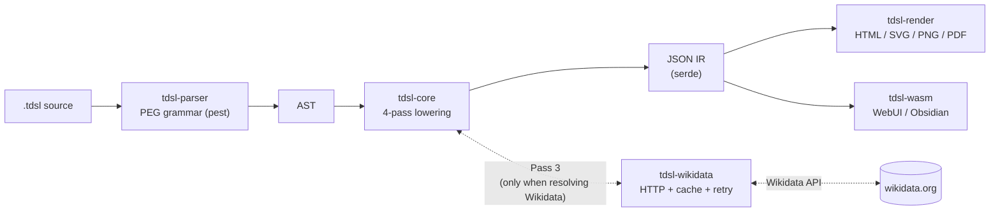
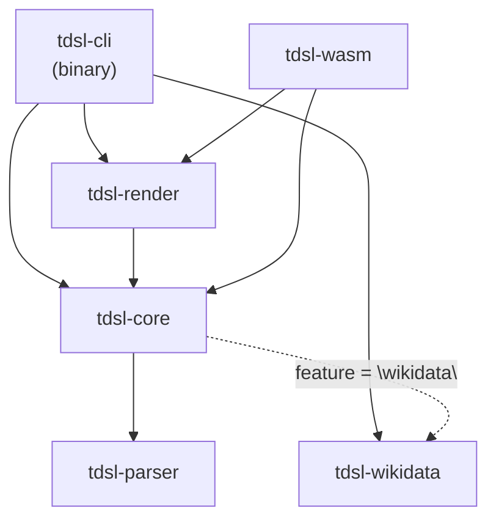

# Timeline DSL

[](https://github.com/keroway/timeline-dsl/actions/workflows/ci.yml)
[](https://github.com/keroway/timeline-dsl/actions/workflows/release.yml)
[](./LICENSE)
[](https://doc.rust-lang.org/edition-guide/rust-2024/)
[](https://pest.rs/)
[](./crates/tdsl-wasm)
[](https://www.npmjs.com/package/@keroway/tdsl-wasm)
[](https://marketplace.visualstudio.com/items?itemName=keroway.timeline-dsl)

A domain-specific language (DSL) compiler for timelines. Define timelines as text, import data from Wikidata, and visualize them as HTML/SVG.

**Tech stack**: Rust 2024 workspace · [pest](https://pest.rs/) PEG parser · 4-pass IR lowering · `wasm-bindgen` for the browser · `serde` JSON IR. See [docs/architecture.en.md](docs/architecture.en.md) for the internals.

**[Landing Page →](https://timeline-dsl-lp.pages.dev/)** | **[Try it in the WebUI →](https://keroway.github.io/timeline-dsl/)**

> 日本語版: [README.ja.md](./README.ja.md)

## Features

- **Declarative DSL** — Define timelines as text with a C-like syntax. Perfect for Git-based version control and diff reviews
- **Wikidata integration** — Automatically fetch historical data by specifying a QID. Local cache (24-hour TTL) enables offline use
- **Interactive HTML output** — Generate standalone HTML with built-in zoom, pan, search, legend, and detail panel
- **SVG output** — Export as vector format for use in papers and slides
- **PDF output** — Export as vector PDF (via `svg2pdf`) for printing and document embedding
- **Color mapping** — Declare tag-to-color mappings in the DSL or via CLI flags
- **Decompiler** — Regenerate `.tdsl` source from a JSON IR
- **WebUI** — Real-time editing and preview in the browser (WASM-powered), with font size and light/dark theme selection
- **Lane structure** — Organize dynasties, people, nations, etc. into lanes (vertical categories)
- **3 time element types** — `span` (duration), `event` (point event), `event_range` (range event)
- **Extended time precision** — Year, month, day, minute-level time-of-day (`YYYY-MM-DDTHH:MM`), and BCE month/day dates (e.g. `-0206-01-15`)
- **License tracking** — Automatically records the source of Wikidata data (CC0)

## Installation

### One-line install (macOS / Linux)

```sh
curl -sSfL https://raw.githubusercontent.com/keroway/timeline-dsl/main/install.sh | sh
```

Supported platforms: macOS (x86\_64, arm64), Linux (x86\_64, aarch64).

### One-line install (Windows)

Run in PowerShell:

```powershell
irm https://raw.githubusercontent.com/keroway/timeline-dsl/main/install.ps1 | iex
```

### Homebrew (macOS / Linux)

```sh
brew tap keroway/tap
brew install tdsl
```

### cargo-binstall (fast)

```sh
cargo binstall tdsl-cli
```

Requires [cargo-binstall](https://github.com/cargo-bins/cargo-binstall) to be installed first. Downloads pre-built binaries directly — no source compilation needed.

### Install via cargo

```sh
cargo install --git https://github.com/keroway/timeline-dsl tdsl-cli
```

## Quick Start

### Basic usage

```bash
# Compile a DSL file to JSON
tdsl build examples/china_dynasties.tdsl --pretty

# Syntax and semantic check
tdsl check examples/china_dynasties.tdsl

# Render to standalone HTML (just open in a browser; no external font/CDN dependency)
tdsl render examples/china_dynasties.tdsl --output china.html
open china.html

# Interactive HTML (with zoom, pan, search, detail panel)
tdsl render examples/china_dynasties.tdsl --interactive --output china.html

# HTML with item listing table (time / label / lane / tags)
tdsl render examples/china_dynasties.tdsl --show-table --output china.html

# Static legend panel (lane colors / tag color overrides)
tdsl render examples/china_dynasties.tdsl --show-legend --output china.html

# Output as SVG
tdsl render examples/china_dynasties.tdsl --format svg --output china.svg

# Output as PNG (rasterized via resvg)
tdsl render examples/china_dynasties.tdsl --format png --output china.png

# Output as vector PDF (via svg2pdf)
tdsl render examples/china_dynasties.tdsl --format pdf --output china.pdf

# Output as A3 landscape PDF with 15 mm margins
tdsl render examples/china_dynasties.tdsl --format pdf --pdf-size a3 --pdf-landscape --pdf-margin 15 --output china_a3.pdf

# Vertical layout (time axis runs top to bottom)
tdsl render examples/china_dynasties.tdsl --orientation vertical --output china_vertical.html

# Auxiliary grid lines (decade / year / month)
tdsl render examples/china_dynasties.tdsl --grid decade --output china_grid.html

# Era/group background bands for contiguous lane groups
tdsl render examples/china_dynasties.tdsl --layout-style group-bands --output china_bands.html

# Watch mode: re-render automatically on file changes (--output required; html / svg only)
tdsl render examples/china_dynasties.tdsl --watch --output china.html

# Compile with Wikidata integration
tdsl build examples/china_with_import.tdsl --pretty

# Offline mode (skip Wikidata fetching entirely; only static items are compiled)
tdsl build examples/china_with_import.tdsl --offline --pretty

# AST dump (for debugging)
tdsl ast examples/china_dynasties.tdsl

# Inspect a Wikidata entity
tdsl fetch Q7209 --lang ja,en

# Resolve a Wikipedia URL to a QID
tdsl resolve "https://ja.wikipedia.org/wiki/漢" --lang ja,en

# Decompile JSON IR back to .tdsl source
tdsl decompile output.json --output restored.tdsl

# Compile multiple files (merged in order)
tdsl build part1.tdsl part2.tdsl --pretty

# Merge multiple files with the dedicated merge command
tdsl merge base.tdsl extensions.tdsl --output merged.json --pretty

# Check cache status
tdsl cache status

# Clear old cache entries (older than 7 days)
tdsl cache clear --older-than 7
```

### Quickest workflow (starting from Wikidata)

```bash
# 1) Search for candidates
tdsl search "Han dynasty" --lang en -n 5

# (optional) Resolve a Wikipedia URL to a QID
tdsl resolve "https://en.wikipedia.org/wiki/Han_dynasty"

# 2) Verify timeline suitability
tdsl inspect Q7209 --lang ja,en

# 3) Generate a .tdsl template
tdsl scaffold wikidata \
  --qids Q7183,Q7209 \
  --timeline "Chinese Dynasties (generated)" \
  --lang ja,en \
  --target auto \
  --lane-mode per-entity \
  --output /tmp/china_scaffold.tdsl

# 4) Render to HTML
tdsl render /tmp/china_scaffold.tdsl --output /tmp/china_scaffold.html
```

> `search / inspect / resolve / scaffold wikidata` require a network connection.

### Quickest workflow (starting from scratch)

```bash
# 1) Generate a timeline template
tdsl init \
  --output /tmp/manual.tdsl \
  --timeline "Fictional World Timeline" \
  --range-start 1000 \
  --range-end 1300 \
  --lanes "Kingdoms:kingdom,Events:incidents"

# 2) Append items from a CSV
tdsl import-csv examples/fictional_empire_items.csv --append /tmp/manual.tdsl

# 3) Fix quality issues
tdsl lint /tmp/manual.tdsl --fix

# 4) Render to HTML
tdsl render /tmp/manual.tdsl --output /tmp/manual.html

# 5) Export items back to CSV (symmetric with import-csv)
tdsl export-csv /tmp/manual.tdsl --offline --output /tmp/manual_items.csv
```

> `export-csv` writes the IR to CSV (`lane,type,start,end,time,label,tags,id,source,origin`).
> Re-importing the first 8 columns via `import-csv` yields a semantically equal IR; `source` /
> `origin` are emitted for reference but ignored on import. See [docs/cli-spec.md](docs/cli-spec.md#export-csv).

## DSL Syntax

### timeline block

Declares the title, unit, display range, calendar, and color mapping. Supported `unit` values are `year`, `month`, `day`, `hour`, and `minute`; unknown values fail during lowering instead of falling back silently.

```
timeline "Chinese Dynasties" {
    title "Chinese Dynasties";
    unit year;
    range -500..2000;
    calendar proleptic_gregorian;
    color_map {
        dynasty: "#3366cc";
        war:     "#cc0000";
    }
}
```

`color_map` accepts hex colors (`#RGB`, `#RGBA`, `#RRGGBB`, `#RRGGBBAA`) and simple CSS named color keywords. More complex CSS values are intentionally ignored by the renderer; use CLI `--custom-css` for advanced styling.

`color_map` keys accept either a bare `ident` (ASCII) or a quoted string literal (any Unicode), so non-ASCII tags such as `"戦争"` can have a color assigned directly in the DSL:

```
color_map {
    war: "#cc0000";     // bare ident key
    "戦争": "#cc0000";   // string literal key (non-ASCII)
}
```

### lane declaration

Defines a vertical category on the timeline. Use `as` to specify the internal ID. Known `kind` values are `custom`, `dynasty`, `person`, `country`, and `event`; unknown values are reported as validation warnings.

```
lane "Han" as han { kind dynasty; order 20; }
```

### group block

Groups multiple lanes together. The rendered output shows a group label and boundary lines for visual hierarchy. Existing `.tdsl` files without `group` work as before.

```
group "Ancient China" {
    lane "Qin" as qin { kind dynasty; order 10; }
    lane "Han" as han { kind dynasty; order 20; }
}
```

### span / event / event_range

Time elements on the timeline, attached to a lane.

```
// Duration
span han -206..220 "Han" { tags ["dynasty"]; source wd:Q7209; id "span:han"; note "Imperial dynasty"; link "https://www.wikidata.org/wiki/Q7209"; color "#3366cc"; };

// Point event
event han -209 "Dazexiang Uprising" {};

// Range event (wars, disasters, etc.)
event_range han 184..204 "Yellow Turban Rebellion" { tags ["war"]; };

// Open-ended (still ongoing) period: use `now` as the end
span reiwa 2019..now "Reiwa era" { tags ["era"]; };
```

`now` resolves to the current UTC year at build/parse time and marks the item as open-ended (`end_open: true` in the IR). Rendered output gets a `tdsl-item-open-ended` CSS hook (dashed border by default) and the tooltip shows the ongoing marker instead of a placeholder end year. `tdsl decompile` re-emits `now` for such items. Out of scope: `now` as a fallback inside `map` blocks (e.g. `end claim(P582).year ?? now;`) — `now` is only valid in the `end` position of a directly-defined `span`/`event_range`.

Item options also support `note "...";`, `link "https://...";` (only `http://` / `https://` URLs are accepted), and `color "...";`. Item `color` takes precedence over `color_map` tag colors and lane palette colors.

### import block

Declares data to be imported from Wikidata.

```
import wikidata as wd {
    entity Q7183 as qin_dynasty;
    entity Q7209 as han_dynasty;
    policy merge_by_source;
    // Field-level merge strategy (optional)
    policy field_priority {
        label: manual;    // prefer manually defined labels
        time:  wikidata;  // prefer Wikidata times
        tags:  merge;     // merge tags from both sources
    }
}
```

### map block

Rules for converting imported entities into timeline elements.

```
map wd.han_dynasty to span {
    lane han;
    start claim(P571).year;      // inception
    end claim(P576).year;        // dissolved
    label label@ja ?? label@en;  // Japanese preferred, English fallback
    tags ["dynasty", "imported"];
}
```

### template / apply syntax

Reuse common mapping patterns across multiple imports.

```
template "Dynasty span" as dynasty_span to span {
    start claim(P571).year;
    end claim(P576).year;
    label label@ja ?? label@en;
}

apply dynasty_span to wd {
    lane han;
}
```

> `source` is automatically attached to imported items as `wd:<entity_id>`. Explicit specification inside a `map` block is not needed.
> `policy` controls behavior on ID conflicts:
> `merge_by_source` treats conflicts as errors; `overwrite_imported` replaces only existing imported items;
> `keep_manual` skips the incoming item if an existing (manually defined) item is present.

## Example Files

| File | Content |
|---|---|
| `examples/china_dynasties.tdsl` | Static definitions only — Qin, Han, Three Kingdoms; explicit item IDs |
| `examples/china_with_import.tdsl` | With Wikidata integration — imports Qin and Han from QIDs (CLI/network sample) |
| `examples/template_apply_example.tdsl` | Sample usage of template / apply syntax and `policy field_priority` |
| `examples/grouped_dynasties.tdsl` | Sample usage of the `group` block — visually grouped lanes, static definitions |
| `examples/officeholder_wikidata.tdsl` | Positions held (P39) expanded into multiple spans. Wikidata integration (`expand` / `qualifier(P580/P582)`) |
| `examples/fictional_empire.tdsl` | Manual timeline for a fictional world; demonstrates `color_map` and CSV import workflow |
| `examples/fictional_empire_items.csv` | Sample CSV input for `import-csv` |
| `examples/japanese_history.tdsl` | Japanese history (Nara–Edo). Multi-lane, static definitions |
| `examples/samurai_wikidata.tdsl` | Birth/death years of feudal lords. Wikidata integration (P569/P570; CLI/network sample) |
| `examples/world_wars.tdsl` | Modern wars timeline, centered on `event_range`; includes month/day precision dates |
| `examples/sci_tech_timeline.tdsl` | Science and technology timeline, centered on event |
| `examples/apollo_11.tdsl` | Apollo 11 mission timeline with month/day precision dates |
| `examples/apollo_11_hourly.tdsl` | Apollo 11 landing-day timeline showcasing `unit hour` sub-day axis ticks |
| `examples/internet_history.tdsl` | Internet/Web history with mixed `span` and `event` items |

## GitHub Actions Integration

Use `uses: keroway/timeline-dsl@v1` to render `.tdsl` files to SVG / HTML.

```yaml
- uses: keroway/timeline-dsl@v1
  with:
    file: examples/china_dynasties.tdsl
    format: svg
    output: china.svg
    offline: 'true'
```

Key inputs:

| Input | Default | Description |
|---|---|---|
| `file` | — | Path to the `.tdsl` file to render (required) |
| `format` | `svg` | Output format: `svg`, `html`, `png`, or `pdf` |
| `output` | `<basename>.<format>` | Output file path |
| `offline` | `false` | Skip Wikidata fetching (recommended for CI) |
| `interactive` | `false` | Interactive HTML output (when `format: html`) |
| `show_table` | `false` | Append an item listing table after the SVG (when `format: html`) |
| `theme` | — | Theme: `default` / `dark` / `print` / `pastel` |
| `version` | `latest` | tdsl version to use (e.g. `v1.5.0`) |

The `output_path` output contains the absolute path to the generated file.

See [docs/ci-integration.md](docs/ci-integration.md) for full usage details.

## Editor Support

### VS Code Syntax Highlighting

An extension is available under `editors/vscode/`. It color-codes keywords, strings, comments, QIDs, and more in `.tdsl` files.

**Install from Marketplace:**

Press `Ctrl+P` (macOS: `Cmd+P`) in VS Code and run:

```
ext install keroway.timeline-dsl
```

Or install directly from the [VS Code Marketplace](https://marketplace.visualstudio.com/items?itemName=keroway.timeline-dsl).

**Manual install:**

```bash
cp -r editors/vscode ~/.vscode/extensions/timeline-dsl
# Restart VS Code
```

Highlighted elements:

- Keywords: `timeline`, `lane`, `span`, `event`, `event_range`, `import`, `map`, `template`, `apply`, `color_map`
- String literals (double-quoted)
- Comments (`//` and `/* */`)
- Wikidata QIDs (`Q123`), property IDs (`P569`), references (`wd:Q123`)
- `claim(P571).year` expressions, `label@ja` expressions

## Merging Files

Combine multiple `.tdsl` files into a single IR.

```bash
# Specify multiple files with tdsl build (merged in order)
tdsl build base.tdsl additions.tdsl --pretty

# Use tdsl merge for explicit merging
tdsl merge base.tdsl additions.tdsl --output merged.json --pretty
```

The `timeline` metadata (title / range / calendar) from the first file takes precedence. `lane` entries are collected from all files, and `item` entries are appended in order with duplicate ID detection.

## Language Server (LSP)

`tdsl lsp`

Starts a Language Server Protocol server over stdio. Connect your editor to get real-time diagnostics (parse errors and validation warnings with line/column positions).

```bash
# Start the LSP server (blocks waiting for JSON-RPC on stdin)
tdsl lsp
```

**Supported features:** `textDocument/publishDiagnostics` — parse errors and validation warnings with accurate line/column numbers. `textDocument/completion` — keyword completion for all DSL keywords (context-independent). `textDocument/hover` — hover over a lane ID to see its label/kind/order; hover over a QID to see cached entity info (offline, no network required). `textDocument/definition` — jump from a lane reference to its declaration. `textDocument/references` — find all references to a lane ID. `textDocument/rename` / `prepareRename` — rename a lane declaration and all its references (lanes declared with an explicit `as <alias>` only; lanes with an auto-generated slug are rejected). `textDocument/documentSymbol` — outline of timeline / lanes / items. `textDocument/codeAction` — `lint --fix` quick fixes. `textDocument/formatting` — canonical source formatting (comments are preserved like `tdsl fmt`; comments inside blocks may be relocated to canonical positions).

**VS Code extension:** Install the [Timeline DSL VS Code extension](https://marketplace.visualstudio.com/items?itemName=keroway.timeline-dsl) for full editor integration — diagnostics, completion, hover, go-to-definition, rename, code actions, and formatting are provided via the built-in LSP client.

## Lint

`tdsl lint <file> [--fix] [--format text|json]`

- Rules: undefined lane reference / duplicate ID / `start > end` / empty label / empty or duplicate tags
- `--fix`: removes duplicate/empty tags, swaps `start`/`end`, generates stable IDs for items without one
- `--format json`: outputs an issue list and an `ok` flag for CI integration

## WebUI

**[Try it in your browser →](https://keroway.github.io/timeline-dsl/)**

A browser-based editor powered by WASM. Create and preview timelines without installing anything.

### Key features

- **Live preview**: SVG updates instantly as you edit (500ms debounce)
- **Diagnostics panel**: Syntax and semantic errors displayed with line numbers
- **Font size selector**: Choose editor font size from 12px to 18px
- **Light/dark theme**: Switch color schemes with one click
- **File operations**: Open a local `.tdsl` file / download as `.tdsl`, SVG, or standalone HTML
- **Template gallery**: Select examples sourced directly from `examples/*.tdsl`; network-required samples are marked as CLI-only references
- **Tooltips**: Hover over SVG items to see item details

> **Limitation**: Wikidata imports (`import wikidata`) are not resolved in the browser. Only static `span`, `event`, and `event_range` items are previewed.

## WASM npm Package

`@keroway/tdsl-wasm` is available on npm for use in JavaScript/TypeScript projects (Obsidian plugins, custom web apps, etc.):

```bash
npm install @keroway/tdsl-wasm
```

> **Note**: Wikidata imports are not supported in browser/WASM environments. Only static `span`, `event`, and `event_range` items are compiled.

### Publishing via Trusted Publishing / OIDC (maintainers)

CI publishes `@keroway/tdsl-wasm` using npm **Trusted Publishing** (OIDC). No long-lived `NPM_TOKEN` secret is required — the `Release` workflow mints a short-lived OIDC token via `permissions: id-token: write`, and npm generates a provenance attestation automatically.

One-time setup on npmjs.com (per package):

1. Open the package settings: **npmjs.com → @keroway/tdsl-wasm → Settings → Trusted Publisher**
2. Add a GitHub Actions publisher with:
   - **Organization or user**: `keroway`
   - **Repository**: `timeline-dsl`
   - **Workflow filename**: `release.yml` (filename only, must match exactly)
   - **Environment**: leave blank
   - **Allowed actions**: enable `npm publish`
3. Save. Subsequent release tag pushes publish automatically with no token.

> **First publish (bootstrapping a brand-new package)**: npm requires the package to already exist before you can configure a Trusted Publisher in the UI. For the very first version, publish once locally — `cd crates/tdsl-wasm/pkg && npm publish --access public` after a `wasm-pack build --target web --release --scope keroway` — then add the Trusted Publisher and let CI take over.

To manually re-publish (e.g., if CI failed): go to **Actions → Release → Run workflow** and enter the version number.

## Rust Library (crates.io)

The core crates are published on [crates.io](https://crates.io) and can be used as Rust library dependencies:

| Crate | Description |
|-------|-------------|
| [`tdsl-parser`](https://crates.io/crates/tdsl-parser) | PEG parser — produces an AST from `.tdsl` source |
| [`tdsl-wikidata`](https://crates.io/crates/tdsl-wikidata) | Wikidata API client used by the compiler |
| [`tdsl-core`](https://crates.io/crates/tdsl-core) | IR types, 4-pass lowering, and validation |
| [`tdsl-render`](https://crates.io/crates/tdsl-render) | SVG / HTML / PDF rendering from IR |

Add them to your `Cargo.toml`:

```toml
[dependencies]
tdsl-parser = "1"
tdsl-core = "1"
tdsl-render = "1"
```

Basic usage example (parse and lower a `.tdsl` file to IR):

```rust
use tdsl_parser::parse_file;
use tdsl_core::lower_static;

let source = r#"
    timeline "My Timeline" { unit: year; range: 1900..2000; }
    lane Milestones "Milestones"
    event Milestone1 at 1950 in Milestones label "Halfway"
"#;
let ast = parse_file(source).unwrap();
let ir = lower_static(ast).unwrap();
println!("{}", serde_json::to_string_pretty(&ir).unwrap());
```

## Documentation

- [Getting Started Tutorial](docs/tutorial.en.md) — Step-by-step hands-on guide
- [DSL Language Reference](docs/dsl-spec.en.md) — Grammar reference
- [CLI Subcommand Reference](docs/cli-spec.md) — All subcommands, options, and examples
- [Styling Customization Guide](docs/styling.md) — CSS customization via `--theme` / `--custom-css`
- [Error Code Catalog](docs/error-catalog.md) — Causes and fixes for error messages
- [v0 to v1 Migration Guide](docs/migration-v0-to-v1.md) — Changes when upgrading
- [WebUI Design](docs/webui-design.md) — Design notes for the WASM + static site architecture
- [Architecture Deep Dive](docs/architecture.en.md) — 4-pass lowering, Wikidata cache/retry, WASM facade constraints, crate dependency rules

## Architecture

### Compilation pipeline



The 4 passes (`Pass 1` collect declarations · `Pass 2` static items · `Pass 3` resolve Wikidata imports · `Pass 4` apply `map` blocks) and the cache / retry design are documented in [docs/architecture.en.md](docs/architecture.en.md). The browser / WASM build and `tdsl build --offline` both skip Pass 3 entirely — only the online CLI path constructs a Wikidata client.

### Crate dependency graph



`tdsl-parser` and `tdsl-wikidata` are leaves with no internal dependencies. `tdsl-core` opts into Wikidata resolution behind the `wikidata` Cargo feature, which `tdsl-cli` enables but `tdsl-wasm` does not — see [docs/architecture.en.md](docs/architecture.en.md) for the dependency rules.

### Crate overview

| Crate | Role |
|---|---|
| `tdsl-parser` | PEG grammar definition and AST construction |
| `tdsl-core` | IR conversion (lowering), validation, decompiler |
| `tdsl-wikidata` | Wikidata HTTP client, entity model, cache |
| `tdsl-render` | IR → HTML (static / interactive) / SVG / PNG / PDF renderer |
| `tdsl-wasm` | WASM facade for the WebUI (`wasm-bindgen`) |
| `tdsl-cli` | CLI binary (all subcommands) |

## IR (Intermediate Representation) Structure

The compiled JSON IR has the following structure:

```json
{
  "meta": {
    "title": "Chinese Dynasties",
    "unit": "year",
    "range": [-500, 2000],
    "calendar": "proleptic_gregorian",
    "color_map": { "dynasty": "#3366cc", "war": "#cc0000" }
  },
  "lanes": [
    {"id": "han", "label": "Han", "kind": "dynasty", "order": 20}
  ],
  "items": [
    {"type": "span", "id": "span:han", "lane": "han", "start": -206, "end": 220, "label": "Han", "tags": ["dynasty"], "source": "wd:Q7209", "origin": "wikidata"}
  ],
  "imports": [
    {"source": "wikidata", "qid": "Q7209", "mapped_to": "span:han"}
  ],
  "sources": [
    {"id": "wd:Q7209", "provider": "wikidata", "license": "CC0"}
  ]
}
```

## Wikidata Properties

Frequently used properties for building timelines:

| Property | Usage | DSL syntax |
|---|---|---|
| P569 | Birth year of a person | `claim(P569).year` |
| P570 | Death year of a person | `claim(P570).year` |
| P571 | Inception year of an organization or country | `claim(P571).year` |
| P576 | Dissolution year of an organization or country | `claim(P576).year` |
| P580 | Start time | `claim(P580).year` |
| P582 | End time | `claim(P582).year` |

## Testing

```bash
cargo test --workspace

# E2E smoke test (same as CI)
bash scripts/e2e-smoke.sh

# Benchmarks
cargo bench --workspace
```

### Code Coverage

CI measures code coverage using [`cargo-llvm-cov`](https://github.com/taiki-e/cargo-llvm-cov) on every push and pull request. The coverage report (lcov format) is uploaded as the `coverage-report` artifact in the CI run.

**Coverage targets (guidelines, not enforced gates):**

| Crate | Target |
|---|---|
| `tdsl-parser` | 70%+ |
| `tdsl-core` | 60%+ |
| `tdsl-render` | 50%+ |

**Known uncovered paths** (areas to improve in future issues):

- `tdsl-wikidata`: HTTP error handling branches (rate-limit / 5xx retry logic) — requires live network or mock HTTP server
- `tdsl-render`: PDF rendering path (`svg2pdf` conversion) — depends on external binary, skipped in unit tests
- `tdsl-cli`: offline fallback and `--offline` flag branches in `build` / `merge` subcommands

To run coverage locally (requires `cargo-llvm-cov`):

```bash
cargo install cargo-llvm-cov
cargo llvm-cov --workspace --all-targets --summary-only
```

## License

### This software

MIT License — see [LICENSE](./LICENSE) for details.

### Data imported from Wikidata

Structured data from Wikidata is provided under [CC0 1.0](https://creativecommons.org/publicdomain/zero/1.0/). Data imported with `tdsl` can be used freely without attribution. This is independent of the license for this software (MIT).
