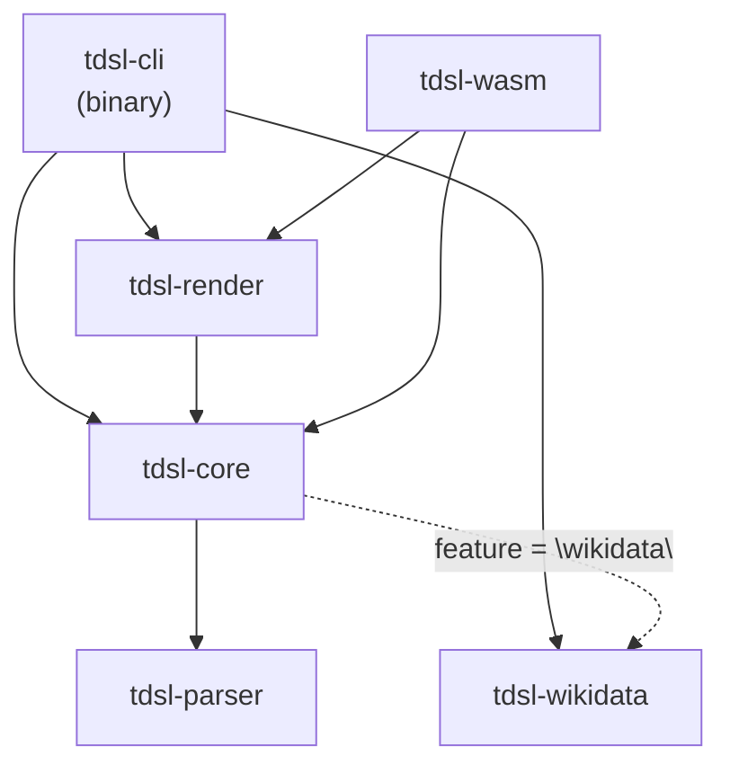
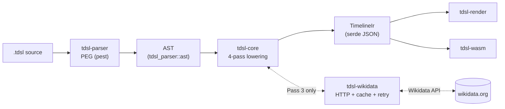
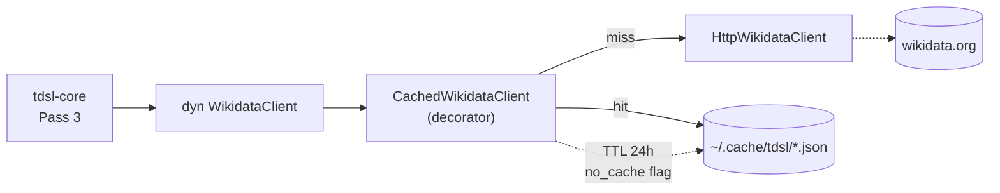

# Timeline DSL — Architecture Deep Dive

> 日本語版: [architecture.md](./architecture.md)

This document expands the "Architecture" section in the README so that an engineer landing on the repo can pick up the system's internals without grepping the codebase first.

Target audience:

- People who want to understand the Rust workspace's crate boundaries and responsibilities.
- People who want to know what each pass of the 4-pass lowering actually does.
- People who need the Wikidata client's cache / retry behavior to plan operations or CI.
- People integrating the `tdsl-wasm` facade into external products (Obsidian, the WebUI, etc.) and need to understand its constraints.

## Crates and dependency rules

| Crate | Role | Internal deps |
|---|---|---|
| `tdsl-parser` | Builds the AST from the PEG grammar (pest) | none (leaf) |
| `tdsl-wikidata` | Wikidata REST/SPARQL client, cache, retry logic | none (leaf) |
| `tdsl-core` | AST → IR lowering (4 passes), validation, decompiler | `tdsl-parser`, `tdsl-wikidata` (only when the `wikidata` feature is enabled) |
| `tdsl-render` | IR → HTML (static / interactive), SVG, PNG | `tdsl-core` (`default-features = false`) |
| `tdsl-wasm` | Browser-facing WASM facade (`wasm-bindgen`) | `tdsl-parser`, `tdsl-core` (`default-features = false`), `tdsl-render` |
| `tdsl-cli` | CLI binary (every subcommand) | `tdsl-parser`, `tdsl-core` (with `wikidata`), `tdsl-wikidata`, `tdsl-render` (with `png`) |

### Dependency rules (implementation policy)

These rules are aligned with `.claude/rules/implementation-strict.md` §2 "NO-GO". Any deviation requires explicit review.

- **No upward dependencies**: lower crates (`tdsl-parser`, `tdsl-wikidata`) must not depend on higher ones (`tdsl-core`, `tdsl-render`, `tdsl-cli`). Conversely, `tdsl-core` must not pull in `tdsl-cli` or `tdsl-render`.
- **Wikidata integration is gated by a Cargo feature on `tdsl-core`**: `tdsl-core` must build cleanly even with the `wikidata` feature disabled. `tdsl-wasm` and `tdsl-render` deliberately switch `default-features` off to opt out.
- **HTTP / I/O stays inside `tdsl-wikidata`**: do not add new HTTP clients or `reqwest` dependencies in other crates. The `WikidataClient` trait is the only seam — keep it mockable for tests.
- **`tokio::spawn` is `tdsl-cli`-only**: library crates must not spawn their own runtime.

If a change must break the dependency graph, consult `.claude/agents/app-dev-director.md` before implementing it.

## Compilation pipeline

End to end, the pipeline looks like this:

1. **Parse**: `tdsl-parser` runs the PEG grammar (`crates/tdsl-parser/src/grammar.pest`) and returns an `ast::File`. Line and block comments (`//`, `/* */`) are dropped at this layer.
2. **Lowering (4 passes)**: `tdsl-core`'s `lower_static_with_source` (or `lower_with_wikidata_and_source`) turns the AST into a `TimelineIr`. Details below.
3. **Validation**: lane references, range consistency, unused lanes, etc. are checked inline during lowering. Errors are accumulated and returned as `Vec<LoweringError>`.
4. **Serialize / render**: `serde` serializes the IR to JSON. `tdsl-render` turns the same IR into HTML / SVG / PNG. The browser path goes through `tdsl-wasm`.

### Pass-by-pass responsibilities

`LoweringContext` in `crates/tdsl-core/src/lower.rs` orchestrates the four passes. Each pass reads what the previous one produced and **only does its own job**:

| Pass | Method | Input | Output / side effect | Main checks |
|------|--------|-------|----------------------|-------------|
| Pass 1 | `pass1_declarations` | Whole AST | Populates the `meta` and `lanes` tables | Duplicate timeline/lane declarations, missing required metadata |
| Pass 2 | `pass2_static_items` | `span` / `event` / `event_range` statements + line offsets | Appends static items to `items[]`, attaches `source_span` when a source string was provided | Lane reference existence, ID uniqueness, range consistency |
| Pass 3 | `pass3_resolve_imports` | `import wikidata` statements + a `WikidataClient` | Stores resolved entities in an intermediate table, updates `imports[]` | QID existence; SPARQL result cap (`MAX_IMPORT_QUERY_RESULTS = 50`) |
| Pass 4 | `pass4_apply_maps` | `map` statements + the cache built in Pass 3 | Adds imported items to `items[]` with `origin = "imported"` and `source = wd:<QID>` | `target_type` is an enum restricted to `span` / `event` / `event_range`; unresolved `wd.xxx` raises an error instead of being silently dropped |

#### Design notes

- **Pass 1 and Pass 2 are synchronous; only Pass 3 is async**: network I/O is needed solely for Wikidata import resolution, so `async fn` is kept to a minimum. The static path (`lower_static_with_source`) lets the WASM build skip Passes 3 and 4 entirely.
- **Pass 3 never writes into the IR directly**: it builds a `(entity_key, WikidataEntity)` table that Pass 4 reads. This keeps `map` interpretation decoupled from the fetch logic.
- **`source_span` (line / column) is only populated when source text is passed in**: callers of `lower_*_with_source(file, Some(src))` get spans; CLI `build` doesn't pass the source today and therefore omits it. The WebUI / WASM path does pass it, which enables editor ↔ preview cross-jump.
- **Unresolved imports are not silently accepted**: if a `map` references `wd.xxx` that wasn't imported, lowering fails. No implicit "fall back to all results". This follows the strict policy in `.claude/rules/implementation-strict.md` §1.
- **Avoid breaking the IR schema**: new optional fields must carry `#[serde(skip_serializing_if = "Option::is_none")]`. JSON IR is a stable external interface.

## Wikidata client: cache + retry

`tdsl-wikidata` keeps the **HTTP client** and the **cache decorator** as separate types so that swapping out a `WikidataClient` implementation is enough to switch between test, production, and offline modes.

### Overview

### HTTP retry (`HttpWikidataClient::send_with_retry`)

- **Errors handled**: HTTP 429 (rate limit), 5xx (server error), connection errors (`is_connect`).
- **Backoff**: exponential, `2^attempt` seconds. For 429 the client prefers the `Retry-After` header when present.
- **Maximum attempts**: `DEFAULT_MAX_RETRIES = 5` (overridable via `with_options`).
- **Timeout**: `is_timeout()` is converted to `WikidataError::Timeout` immediately — no retry, because hammering a non-responsive endpoint isn't useful.
- **User-Agent**: every request sends `tdsl/<version> (https://github.com/keroway/timeline-dsl)` to comply with Wikidata's policy.

### Cache (`CachedWikidataClient`)

- **Storage**: `dirs::cache_dir()/tdsl/` (macOS: `~/Library/Caches/tdsl/`, Linux: `~/.cache/tdsl/`, Windows: `%LOCALAPPDATA%\tdsl\`). Falls back to `std::env::temp_dir()/tdsl_cache/` when `dirs::cache_dir()` returns `None`.
- **Default TTL**: 24 hours (`CacheOptions::default` is `Duration::from_secs(86400)`).
- **What is cached**: results of `get_entity` and `get_entity_by_sitelink`. `search_entities` and `sparql_query` are intentionally not cached because their results are dynamic.
- **Cache key**: QID + requested languages (e.g. `get_Q7209_ja-en.json`). The sitelink path normalizes site + article title + languages into a filesystem-safe name.
- **Write safety**: writes go through `tempfile::NamedTempFile` and then rename — atomic, so a crashed run never leaves a corrupt cache file behind.
- **CLI hooks**: `tdsl cache status` prints the state; `tdsl cache clear --older-than 7` evicts entries older than 7 days. `--no-cache` / `--offline` flags steer individual runs.

### Offline operation

`tdsl build ... --offline` puts `CachedWikidataClient` into "fail on miss" mode. Useful for CI, rate-limit avoidance, and reproducible builds.

## Why the WASM facade disables Wikidata integration

The public API of `tdsl-wasm` (`compile_to_ir`, `render_svg_from_source`, `render_html_from_source`, `check_source`, `format_source`) only ever calls **the static lowering path (`lower_static_with_source`)**. That is intentional.

Full decision history lives in [ADR-0001](./adr/0001-tdsl-wasm-distribution-and-obsidian-integration.md). The short version:

### Why

1. **No HTTP / I/O runtime in the browser**: `tdsl-wikidata` depends on `reqwest` and `tokio` APIs that don't build for the WASM target. WebUI / Obsidian users also have no real need to hit Wikidata in real time.
2. **The cache layer wouldn't survive**: browsers don't expose a persistent store equivalent to `dirs::cache_dir()`, and rebuilding TTL / retry / atomic write semantics on top of IndexedDB isn't worth the cost.
3. **Editing is the primary use case**: WebUI and the Obsidian plugin operate on `.tdsl` files that already exist locally. The recommended workflow is to use the CLI (`tdsl build`) to pre-resolve Wikidata into IR and then visualize the resulting IR.

### Runtime behavior

- `compile_to_ir` / `render_*_from_source`: even if the AST contains `import wikidata`, only the static path runs. With the `wikidata` feature disabled in `tdsl-core`, Passes 3 and 4 are not compiled in.
- `check_source`: import blocks are silently skipped — no diagnostics, no errors. Imported items don't appear in the output IR.
- A formatted "Wikidata not available in the browser" error is being introduced under ADR D4 (issue `#293`). Once shipped, the API entry points will return that explicit message when an `import` statement is detected.

### Distribution

- npm package name: `@keroway/tdsl-wasm` on the public npm registry.
- Versioning: pinned 1:1 to the Cargo workspace version; CI publishes automatically on release tags.
- See the "WASM npm Package" section in the README for usage and the maintainer setup steps.

## Further reading

- [docs/dsl-spec.en.md](./dsl-spec.en.md) — DSL grammar reference
- [docs/cli-spec.md](./cli-spec.md) — CLI subcommand reference
- [docs/webui-design.md](./webui-design.md) — WebUI / WASM design notes
- [docs/adr/0001-tdsl-wasm-distribution-and-obsidian-integration.md](./adr/0001-tdsl-wasm-distribution-and-obsidian-integration.md) — npm distribution & Obsidian integration decisions
- [docs/error-catalog.md](./error-catalog.md) — error codes and remediations
- [`.claude/rules/implementation-strict.md`](../.claude/rules/implementation-strict.md) — strict implementation policy (dependency direction, NO-GO patterns)
