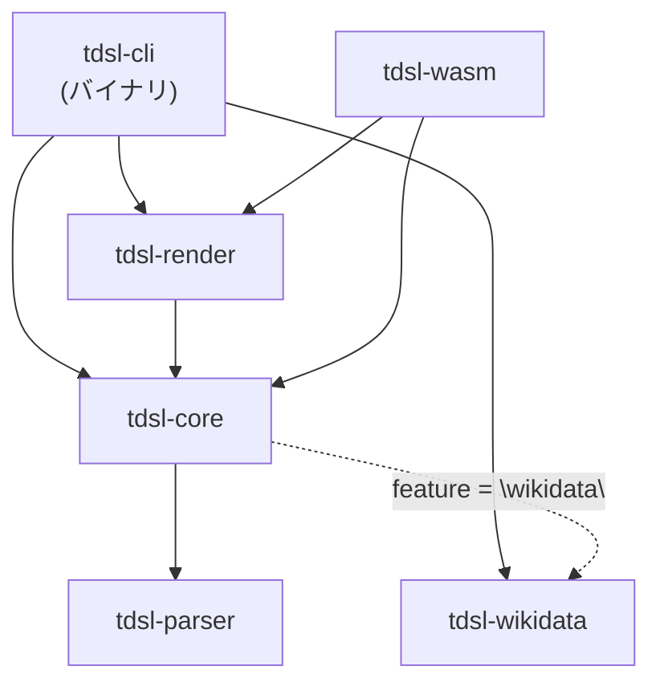
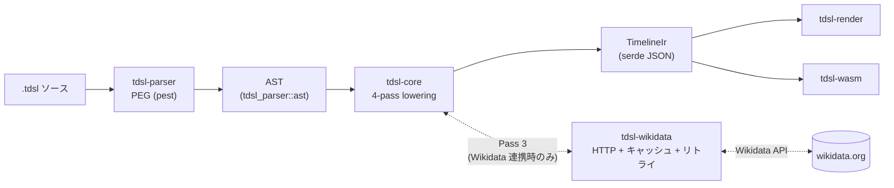
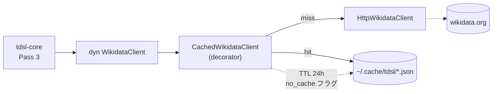

# Timeline DSL アーキテクチャ詳細

> English version: [architecture.en.md](./architecture.en.md)

このドキュメントは Timeline DSL の内部設計を、リポジトリに来た技術者が「どこを読めば全体像をつかめるか」を理解するためにまとめたものです。
README の「アーキテクチャ」セクションの拡張先として位置付けています。

対象読者は次のような人を想定しています:

- Rust ワークスペースの構造と責務分担を把握したい人
- 4-pass lowering の各 pass で何が起きているのかを知りたい人
- Wikidata 取得のキャッシュ・リトライ設計を踏まえて運用を組み立てたい人
- 外部統合（Obsidian / WebUI など）から `tdsl-wasm` を使うときの制約を理解したい人

## クレート構成と依存方向の制約

| クレート | 役割 | 内部依存 |
|---|---|---|
| `tdsl-parser` | PEG 文法（pest）から AST を構築 | なし（リーフ） |
| `tdsl-wikidata` | Wikidata REST/SPARQL クライアント、キャッシュ、リトライ | なし（リーフ） |
| `tdsl-core` | AST → IR の lowering（4 pass）、バリデーション、逆コンパイル | `tdsl-parser`、`tdsl-wikidata`（`wikidata` フィーチャー有効時のみ） |
| `tdsl-render` | IR → HTML（静的 / インタラクティブ）・SVG・PNG | `tdsl-core`（`default-features = false`） |
| `tdsl-wasm` | ブラウザ向け WASM facade（`wasm-bindgen`） | `tdsl-parser`、`tdsl-core`（`default-features = false`）、`tdsl-render` |
| `tdsl-cli` | CLI バイナリ（全サブコマンド） | `tdsl-parser`、`tdsl-core`（`wikidata` フィーチャー有効）、`tdsl-wikidata`、`tdsl-render`（`png` フィーチャー有効） |

### 依存方向のルール（実装ポリシー）

これらのルールは `.claude/rules/implementation-strict.md` の「§2 NO-GO」と整合しています。逸脱する変更を入れるときは必ず先にレビューを通してください。

- **下位クレートから上位クレートへの依存を作らない**: `tdsl-parser` / `tdsl-wikidata` から `tdsl-core` / `tdsl-render` / `tdsl-cli` への依存は不可。逆も同様で、`tdsl-core` から `tdsl-cli` / `tdsl-render` を呼ばない。
- **Wikidata 連携は `tdsl-core` の Cargo フィーチャー越し**: `tdsl-core` は `wikidata` フィーチャーが無効でもビルドできる。`tdsl-wasm` と `tdsl-render` は default-features を切ってこの能力を意図的に外している。
- **HTTP/I/O は `tdsl-wikidata` に閉じ込める**: 新規 HTTP クライアントや `reqwest` 依存をほかのクレートに足さない。`WikidataClient` trait 経由でモック差し替えできる前提を壊さないこと。
- **`tokio::spawn` は `tdsl-cli` のみ**: ライブラリ層で勝手にランタイムを起動しない。

依存グラフを破壊する変更が必要なときは `.claude/agents/app-dev-director.md` に相談してください。

## コンパイルパイプライン

`.tdsl` ソースが入力されてから IR / レンダリング成果物までの流れは次のステップで構成されます。

1. **パース**: `tdsl-parser` が PEG 文法（`crates/tdsl-parser/src/grammar.pest`）でソースを解析し、`ast::File` を返す。コメント（`//` / `/* */`）はこの段階で破棄される。
2. **Lowering（4 pass）**: `tdsl-core` の `lower_static_with_source` または `lower_with_wikidata_and_source` が AST を `TimelineIr` に変換する。詳細は次節。
3. **バリデーション**: lowering 中に lane 参照、range 整合性、未使用 lane などを検査する。エラーは `Vec<LoweringError>` で集約して返す。
4. **シリアライズ / レンダリング**: `serde` で IR を JSON に直列化、または `tdsl-render` が HTML / SVG / PNG に変換する。WebUI / WASM では `tdsl-wasm` がこのレイヤを呼び出す。

### 4-pass lowering の各 pass の責務

`crates/tdsl-core/src/lower.rs` の `LoweringContext` が 4 つの pass を順に実行します。各 pass は前段の結果を**読み取り**、自分の責務だけを完了させる構造になっています。

| Pass | 名称 | 入力 | 出力 / 副作用 | 主な検査 |
|------|------|------|----------------|----------|
| Pass 1 | `pass1_declarations` | AST 全体 | `meta` / `lanes` テーブルを構築 | timeline / lane の重複宣言、必須メタの欠落 |
| Pass 2 | `pass2_static_items` | AST（`span` / `event` / `event_range` 文）+ 行オフセット | `items[]` に静的アイテムを追加し、必要に応じて `source_span` を付与 | lane 参照の存在チェック、ID 重複、range 整合性 |
| Pass 3 | `pass3_resolve_imports` | AST（`import wikidata` 文）+ `WikidataClient` | 解決済みエンティティをキャッシュテーブルに格納、`imports[]` を更新 | QID の存在、`query "SPARQL"` の結果上限（`MAX_IMPORT_QUERY_RESULTS = 50`） |
| Pass 4 | `pass4_apply_maps` | AST（`map` 文）+ Pass 3 のキャッシュ | imported item を `items[]` に投入し、`origin = "wikidata"` / `source = wd:<QID>` を付与し、再インポートポリシー（`merge_by_source` / `overwrite_imported` / `keep_manual`）を適用 | `target_type` が enum で `span` / `event` / `event_range` のみ、未解決 `wd.xxx` を黙って通さない |

#### 設計上のポイント

- **Pass 1 と Pass 2 は同期実装、Pass 3 のみ async**: ネットワーク I/O が必要なのは Wikidata import の解決だけなので、`async fn` を最小限にしている。WASM 向けに静的 lowering（`lower_static_with_source`）を提供することで、ブラウザ環境では Pass 3 / Pass 4 を完全にスキップできる。
- **Pass 3 で取得した結果は IR に直書きしない**: Pass 3 では `(entity_key, WikidataEntity)` の中間テーブルだけを構築し、`items[]` への投入は Pass 4 で行う。これにより `map` ブロックの解釈が Wikidata 取得ロジックから分離されている。
- **`source_span`（行 / 列番号）は `lower_*_with_source` でソースを渡したときだけ付与**: CLI の `build` サブコマンドはソースを渡さないため `source_span` は付かない。WebUI / WASM はソースを渡しているのでエディタ⇄プレビュー間のジャンプに使える。
- **未解決 import は黙って通さない**: `map` の右辺で参照される `wd.xxx` が import に存在しない場合はエラー。後方互換のために「全件フォールバック」のような暗黙挙動を入れないという strict ポリシー（`.claude/rules/implementation-strict.md` §1）に従っている。
- **既存 IR 形式への破壊的変更を避ける**: 新規 optional フィールドは必ず `#[serde(skip_serializing_if = "Option::is_none")]` を付ける。JSON IR の後方互換は外部統合の前提となっている。

## Wikidata クライアント: キャッシュとリトライ設計

`tdsl-wikidata` は **HTTP クライアント本体** と **キャッシュデコレータ** を分離した構成で、`WikidataClient` trait の実装を差し替えるだけでテスト / 本番 / オフラインモードを切り替えられます。

### 構造の俯瞰

### HTTP リトライ（`HttpWikidataClient::send_with_retry`）

- **対象エラー**: HTTP 429（rate limit）と 5xx（server error）、接続エラー（`is_connect`）。
- **バックオフ**: `2^attempt` 秒の exponential backoff。429 の場合は `Retry-After` ヘッダがあれば優先採用。
- **最大試行回数**: `DEFAULT_MAX_RETRIES = 5`（`with_options` で上書き可）。
- **timeout**: `is_timeout()` は即座に `WikidataError::Timeout` に変換し、リトライしない（応答がない場合に何度も叩いても意味がないため）。
- **User-Agent**: `tdsl/<version> (https://github.com/keroway/timeline-dsl)` を必ず送る。Wikidata API のポリシー準拠のため。

### キャッシュ（`CachedWikidataClient`）

- **ストレージ**: `dirs::cache_dir()/tdsl/`（macOS: `~/Library/Caches/tdsl/`、Linux: `~/.cache/tdsl/`、Windows: `%LOCALAPPDATA%\tdsl\`）。`dirs::cache_dir()` が `None` の環境では `std::env::temp_dir()/tdsl_cache/` にフォールバック。
- **デフォルト TTL**: 24 時間（`CacheOptions::default` で `Duration::from_secs(86400)`）。
- **キャッシュ対象**: `get_entity` / `get_entity_by_sitelink` の結果。`search_entities` / `sparql_query` は動的な結果のためキャッシュ対象外。
- **キャッシュキー**: QID と要求言語の組み合わせ（例: `get_Q7209_ja-en.json`）。sitelink 経路はサイト + 記事タイトル + 言語からファイル名安全な形に正規化。
- **書き込みの安全性**: `tempfile::NamedTempFile` で一時ファイルに書いてから rename する atomic write。途中で失敗してもキャッシュが壊れない。
- **CLI 連携**: `tdsl cache status` で状態確認、`tdsl cache clear --older-than 7` で古いエントリのみ削除。`--no-cache` / `--offline` フラグで個別実行を制御できる。

### オフライン運用

`tdsl build ... --offline` はネットワークを完全に切り離す実装になっています（`crates/tdsl-cli/src/main.rs::load_ir`）。具体的には:

- `CachedWikidataClient` も `HttpWikidataClient` も生成せず、Wikidata クライアントを一切作らない。
- `tdsl-core::lower::lower_static` のみを呼び、Pass 3 / Pass 4 をスキップする。
- 結果として、`import wikidata` 文を含む `.tdsl` を `--offline` でビルドすると import は解決されず、imported item は IR に出力されない（map ブロックが参照する `wd.xxx` も解決されないため、`map` を含むファイルでは lowering エラーになる可能性がある）。
- キャッシュ自体は通常モード（オンライン）でのみ参照される。`CachedWikidataClient` は API 呼び出し前に毎回キャッシュをチェックし、TTL 内ならネットワーク不要で結果を返す。つまり「`--offline` フラグなし」でもキャッシュヒット時はオフライン動作と同等のコストになる。

CI や再現可能ビルドのためにネットワークから完全に切り離したいなら `--offline`、本番ビルドだがレート制限を避けたいなら通常モード（キャッシュ駆動）を使い分けてください。

なお `--no-cache` は通常モードに対して「キャッシュを無視して常に API を叩く」フラグであり、`--offline` とは独立に指定できます。

## WASM facade で Wikidata 連携が無効な理由

`tdsl-wasm` の公開 API（`compile_to_ir` / `render_svg_from_source` / `render_html_from_source` / `check_source` / `format_source`）は、**静的 lowering（`lower_static_with_source`）のみ**を呼び出します。これは意図的な設計判断です。

詳細な決定経緯は [ADR-0001](./adr/0001-tdsl-wasm-distribution-and-obsidian-integration.md) に記録されています。要点は次のとおりです。

### 理由

1. **ブラウザに HTTP/I/O ランタイムを持ち込まない**: `tdsl-wikidata` は `reqwest` + `tokio` 依存で、WASM ターゲットでビルドできない API を多数使う。WebUI / Obsidian での実用上、ネットワーク経由でリアルタイムに Wikidata を叩く要件もない。
2. **キャッシュ層が成立しない**: ブラウザ環境では `dirs::cache_dir()` 相当の永続ストレージが直接使えず、リトライ・TTL・atomic write の設計を再実装するコストに見合わない。
3. **オフライン入力での編集を主用途とする**: WebUI / Obsidian プラグインは「既に手元にある `.tdsl` ファイル」を可視化する用途が中心。Wikidata 取得は CLI（`tdsl build`）で IR を事前生成し、IR を貼り付けて使うフローを推奨する。

### 動作上の振る舞い

- `compile_to_ir` / `render_*_from_source`: AST に `import wikidata` 文が含まれていても lowering は静的パスのみを通る。`tdsl-core` 側で `wikidata` フィーチャーが無効だとそもそも Pass 3 / Pass 4 が呼ばれない構造になっている。
- `check_source`: import ブロックは「未解決のまま黙ってスキップ」する。診断結果は `[]`（エラーなし）として返るため、`import` を含む `.tdsl` を WebUI で開いてもエラーにはならないが、imported item は出力 IR に現れない。
- 整形済みエラーメッセージの実装は ADR D4 のもとで進行中（`#293`）。確定後は `compile_to_ir` などの入口で明示的に `import` 検出時のメッセージを返す予定。

### 配布

- npm パッケージ名: `@keroway/tdsl-wasm`（公式 npm registry）。
- バージョニング: Cargo workspace の version に 1:1 で連動し、リリースタグ push 時に CI が自動 publish する。
- 詳細手順は README の「WASM npm パッケージ」セクション参照。

## 参考リンク

- [docs/dsl-spec.md](./dsl-spec.md) — DSL 文法リファレンス
- [docs/cli-spec.md](./cli-spec.md) — CLI サブコマンドリファレンス
- [docs/webui-design.md](./webui-design.md) — WebUI / WASM の設計ノート
- [docs/adr/0001-tdsl-wasm-distribution-and-obsidian-integration.md](./adr/0001-tdsl-wasm-distribution-and-obsidian-integration.md) — npm 配布 / Obsidian 連携の意思決定
- [docs/error-catalog.md](./error-catalog.md) — エラーコードと対処
- [`.claude/rules/implementation-strict.md`](../.claude/rules/implementation-strict.md) — 実装方針 strict ルール（依存方向 / NO-GO パターン）
